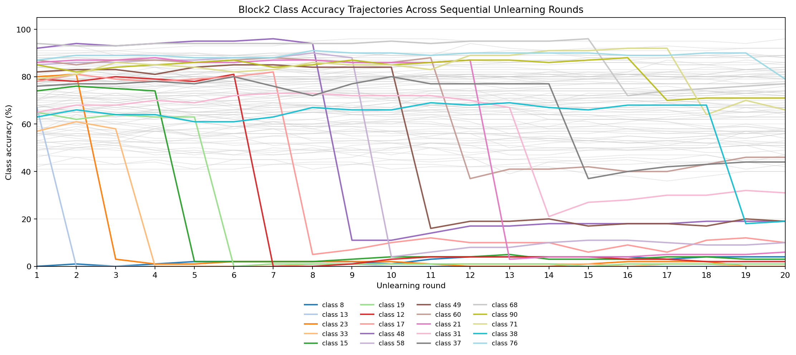
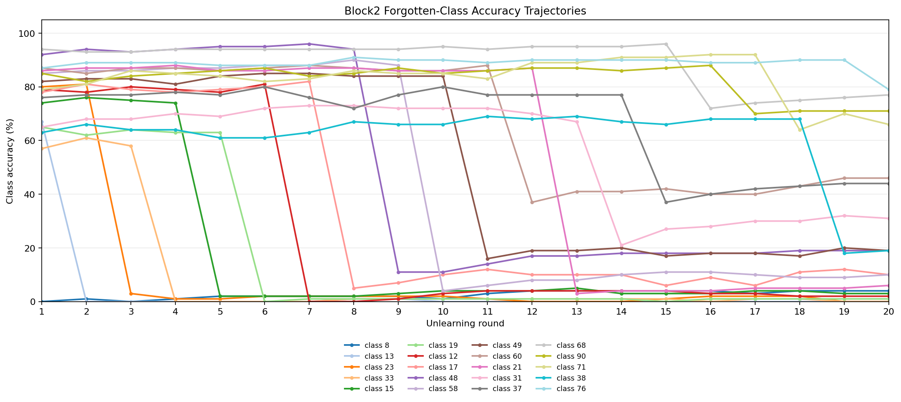

# Block2 Unlearning 實驗分析

## 實驗狀態

本次 `block2` sequential unlearning 實驗已完整執行完成，總共跑完 20 輪忘記序列。執行過程使用 `batch_size=2048`，未發生 CUDA OOM，因此沒有啟用降級到 `1024` 或 `512` 的 fallback。

本次分析資料來源固定為：

- `block2.log`
- `save_exp_M4_Ours/block2/sequential_metrics.csv`

重跑前，先前只完成 3 輪的 partial block2 輸出已備份為：

- `block2.partial_20260609_114238.log`
- `save_exp_M4_Ours/block2.partial_20260609_114238`

## 實驗設定

本次實驗使用 CIFAR-100、ResNet18 與 RL unlearning 方法，依序遺忘 20 個類別。與 `interleaved.md` 的 clustered 實驗相比，本次主要差異是 forget sequence 重新排序，且 `mask_ratio` 從 `0.5` 提高到 `0.7`。

| 項目 | 設定 |
| --- | --- |
| Dataset | CIFAR-100 |
| Architecture | ResNet18 |
| Unlearn method | RL |
| Checkpoint | `./checkpoints/0model_SA_best.pth.tar` |
| Save directory | `./save_exp_M4_Ours/block2` |
| Forget sequence | `8,13,23,33,15,19,12,17,48,58,49,60,21,31,37,68,90,71,38,76` |
| Mask ratio | `0.7` |
| Unlearn epochs | `10` |
| Unlearn learning rate | `0.013` |
| Batch size | `2048` |
| Alpha conflict | `0.6` |

## 核心結果

最終第 20 輪完成後的核心指標如下：

| 指標 | 結果 |
| --- | ---: |
| Retain Accuracy | `69.11%` |
| Current Forget Accuracy | `79.00%` |
| Rebound Score | `22.53%` |
| Max Rebound | `77.00%` |
| Mask Saturation Ratio | `99.84%` |
| MIA Confidence | `46.67%` |
| MIA Prob | `100.00%` |

Retain accuracy 仍然穩定，從第 1 輪的 `70.20%` 到第 20 輪的 `69.11%`，總共下降約 `1.09%`。這表示較高的 `mask_ratio=0.7` 沒有造成 retain set accuracy 大幅崩壞。

但 forgetting quality 明顯變差。第 12 輪之後 current forget accuracy 多次升高，最後第 20 輪 class `76` 的 accuracy 達 `79.00%`，代表最後一個目標類別幾乎沒有被有效遺忘。Rebound 也同步惡化，最終 Rebound Score 為 `22.53%`，Max Rebound 達 `77.00%`。

## 每輪趨勢摘要

下圖以 `save_exp_M4_Ours/block2/sequential_metrics.csv` 的每輪 class accuracy 欄位繪製。第一張圖包含 CIFAR-100 全部 100 個類別，其中 block2 forget sequence 的 20 個類別以彩色線標示，其餘類別以灰線作為背景參考。

第二張圖只保留本次 forget sequence 中的 20 個類別，方便觀察每個被忘記類別在 sequential unlearning 過程中的 accuracy 下降、回彈與後段未完全遺忘現象。

| Round | Forget Class | Retain Acc. | Current Forget Acc. | Rebound | Max Rebound | Mask Sat. | MIA Conf. | MIA Prob |
| ---: | ---: | ---: | ---: | ---: | ---: | ---: | ---: | ---: |
| 1 | 8 | 70.20% | 0.00% | 0.00% | 0.00% | 70.00% | 100.00% | 100.00% |
| 2 | 13 | 70.93% | 0.00% | 1.00% | 1.00% | 85.83% | 100.00% | 99.56% |
| 3 | 23 | 70.51% | 3.00% | 0.00% | 0.00% | 93.14% | 100.00% | 100.00% |
| 4 | 33 | 70.73% | 0.00% | 0.67% | 1.00% | 95.59% | 100.00% | 100.00% |
| 5 | 15 | 70.46% | 2.00% | 0.75% | 2.00% | 97.35% | 100.00% | 98.44% |
| 6 | 19 | 70.69% | 0.00% | 1.20% | 2.00% | 98.12% | 100.00% | 99.78% |
| 7 | 12 | 70.72% | 0.00% | 1.17% | 2.00% | 98.47% | 100.00% | 100.00% |
| 8 | 17 | 70.70% | 5.00% | 1.29% | 2.00% | 98.71% | 100.00% | 100.00% |
| 9 | 48 | 70.53% | 11.00% | 2.25% | 7.00% | 99.02% | 100.00% | 99.33% |
| 10 | 58 | 70.32% | 4.00% | 3.67% | 11.00% | 99.16% | 100.00% | 99.33% |
| 11 | 49 | 70.55% | 16.00% | 4.60% | 14.00% | 99.30% | 100.00% | 99.33% |
| 12 | 60 | 70.31% | 37.00% | 6.18% | 19.00% | 99.42% | 100.00% | 100.00% |
| 13 | 21 | 69.84% | 3.00% | 9.17% | 41.00% | 99.60% | 100.00% | 96.00% |
| 14 | 31 | 69.86% | 21.00% | 8.92% | 41.00% | 99.65% | 99.11% | 99.56% |
| 15 | 37 | 69.86% | 37.00% | 9.86% | 42.00% | 99.67% | 89.33% | 100.00% |
| 16 | 68 | 69.67% | 72.00% | 12.07% | 40.00% | 99.72% | 91.56% | 99.78% |
| 17 | 90 | 69.41% | 70.00% | 16.06% | 74.00% | 99.74% | 61.56% | 100.00% |
| 18 | 71 | 69.12% | 64.00% | 19.82% | 75.00% | 99.77% | 81.33% | 100.00% |
| 19 | 38 | 69.27% | 18.00% | 23.00% | 76.00% | 99.82% | 98.67% | 97.11% |
| 20 | 76 | 69.11% | 79.00% | 22.53% | 77.00% | 99.84% | 46.67% | 100.00% |

## 最終被忘記類別表現

第 20 輪結束後，20 個被忘記類別的最終 accuracy 如下：

| Class | Final Accuracy |
| ---: | ---: |
| 8 | 4% |
| 13 | 0% |
| 23 | 0% |
| 33 | 0% |
| 15 | 3% |
| 19 | 1% |
| 12 | 2% |
| 17 | 10% |
| 48 | 19% |
| 58 | 10% |
| 49 | 19% |
| 60 | 46% |
| 21 | 6% |
| 31 | 31% |
| 37 | 44% |
| 68 | 77% |
| 90 | 71% |
| 71 | 66% |
| 38 | 19% |
| 76 | 79% |

早期類別如 `8`、`13`、`23`、`33`、`15`、`19` 的最終 accuracy 仍維持很低，表示前段 forgetting 有效。後段類別則明顯失效，尤其 class `68`、`90`、`71`、`76` 最終 accuracy 分別為 `77%`、`71%`、`66%`、`79%`。

## 觀察與解讀

`mask_ratio=0.7` 讓 mask saturation 極快接近飽和。block2 在第 3 輪就達到 `93.14%`，第 9 輪達到 `99.02%`，最後第 20 輪達到 `99.84%`。相比 `interleaved.md` 的 clustered 實驗，`mask_ratio=0.5` 在第 20 輪才達到 `97.20%`，block2 幾乎從前段就耗盡可用 mask 空間。

| Round | Block2 Mask Sat. | Interleaved Mask Sat. |
| ---: | ---: | ---: |
| 1 | 70.00% | 50.00% |
| 3 | 93.14% | 73.99% |
| 5 | 97.35% | 80.53% |
| 9 | 99.02% | 91.30% |
| 12 | 99.42% | 94.30% |
| 16 | 99.72% | 96.36% |
| 20 | 99.84% | 97.20% |

這個結果顯示，較高的 `mask_ratio` 雖然在前段可以快速壓低目標類別 accuracy，但代價是後續輪次的可調整區域快速不足。當 mask saturation 接近 `100%` 後，新的 forget class 難以取得有效更新空間，導致 current forget accuracy 和 rebound 同時上升。

Retain accuracy 則相對穩定。這代表本次失敗不是整體模型崩壞，而是 sequential forgetting capacity 被過早消耗。換句話說，`mask_ratio=0.7` 對 20 類 sequential unlearning 來說太激進，較適合短序列或少量類別遺忘，不適合長序列 block setting。

## 風險與限制

本次 block2 只跑單一 seed 與單一 forget sequence，因此結果仍需要多 seed 或不同排序驗證。不過，mask saturation 在前 3 輪就升到 `93.14%` 的現象非常明顯，應該不是單純的後段偶然波動。

MIA 指標在本次結果中也不完全穩定。MIA Prob 多數時間接近 `100%`，但 MIA Confidence 在後段降到 `46.67%`，需要搭配其他 privacy metric 才能做更完整解讀。

此外，本次 block2 的 partial run 曾中斷，因此正式結論只採用重跑後完整 20 輪的 `save_exp_M4_Ours/block2/sequential_metrics.csv`，不使用 partial CSV。

## 建議後續實驗

1. 不建議將 `mask_ratio=0.7` 作為 20 類 sequential unlearning 的預設值；可優先回到 `0.5` 或測試 `0.4`。
2. 若仍要使用 `0.7`，建議縮短 forget sequence，檢查它是否只適合前 5 到 8 類的短序列。
3. 可嘗試動態 mask ratio，例如前段使用 `0.7`，中後段逐步降到 `0.5` 或 `0.3`，避免 saturation 過早接近 `100%`。
4. 對 class `68`、`90`、`71`、`76` 重新排序到前段，檢查它們是本身難忘，還是主要受後段 saturation 影響。
5. 比較 block2 與 clustered 的同一批類別在不同排序下的 final accuracy，分離 sequence order 與 mask ratio 的影響。
