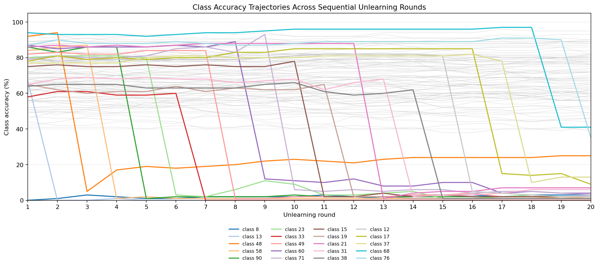
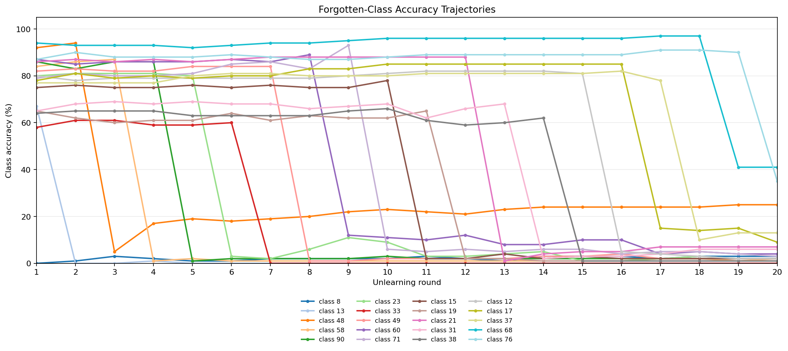

# Interleaved / Clustered Unlearning 實驗分析

## 實驗狀態

本次 `main_forget.py` clustered sequential unlearning 實驗已完整執行完成，總共跑完 20 輪忘記序列，程序以 exit code 0 正常結束。執行過程使用 `batch_size=2048`，未發生 CUDA OOM，因此沒有啟用降級到 `1024` 或 `512` 的 fallback。

本次分析資料來源固定為：

- `clustered.log`
- `save_exp_M4_Ours/clustered/sequential_metrics.csv`

整體來看，環境、資料路徑、checkpoint 載入、CUDA 執行與 sequential unlearning 流程都已可穩定運作。

## 實驗設定

本次實驗使用 CIFAR-100、ResNet18 與 RL unlearning 方法，依序遺忘 20 個類別。

主要設定如下：

| 項目 | 設定 |
| --- | --- |
| Dataset | CIFAR-100 |
| Architecture | ResNet18 |
| Unlearn method | RL |
| Checkpoint | `./checkpoints/0model_SA_best.pth.tar` |
| Save directory | `./save_exp_M4_Ours/clustered` |
| Forget sequence | `8,13,48,58,90,23,33,49,60,71,15,19,21,31,38,12,17,37,68,76` |
| Mask ratio | `0.5` |
| Unlearn epochs | `10` |
| Unlearn learning rate | `0.013` |
| Batch size | `2048` |
| Alpha conflict | `0.6` |

## 核心結果

最終第 20 輪完成後的核心指標如下：

| 指標 | 結果 |
| --- | ---: |
| Retain Accuracy | `69.30%` |
| Current Forget Accuracy | `35.00%` |
| Rebound Score | `6.58%` |
| Max Rebound | `41.00%` |
| Mask Saturation Ratio | `97.20%` |
| MIA Prob | `99.56%` |

從整體趨勢來看，retain accuracy 非常穩定，從第 1 輪的 `70.22%` 到第 20 輪的 `69.30%`，總共只下降約 `0.92%`。這代表模型在保留資料上的效能維持得不錯，沒有因為連續 unlearning 而大幅崩壞。

相對地，forgetting 效果在後段開始變弱。前中段多數被忘類別的 accuracy 可以壓到接近 `0-6%`，但第 19 輪與第 20 輪的當前 forget accuracy 分別升到 `41.00%` 與 `35.00%`，顯示後段類別較難被乾淨遺忘。

## 每輪趨勢摘要

下圖以 `save_exp_M4_Ours/clustered/sequential_metrics.csv` 的每輪 class accuracy 欄位繪製。第一張圖包含 CIFAR-100 全部 100 個類別，其中 forget sequence 的 20 個類別以彩色線標示，其餘類別以灰線作為背景參考。

第二張圖只保留本次 forget sequence 中的 20 個類別，方便觀察每個被忘記類別在 sequential unlearning 過程中的 accuracy 下降、回彈與後段未完全遺忘現象。

| Round | Forget Class | Retain Acc. | Current Forget Acc. | Rebound | Max Rebound | Mask Sat. | MIA Prob |
| ---: | ---: | ---: | ---: | ---: | ---: | ---: | ---: |
| 1 | 8 | 70.22% | 0.00% | 0.00% | 0.00% | 50.00% | 100.00% |
| 2 | 13 | 70.88% | 0.00% | 1.00% | 1.00% | 67.76% | 99.78% |
| 3 | 48 | 70.40% | 5.00% | 1.50% | 3.00% | 73.99% | 100.00% |
| 4 | 58 | 70.38% | 1.00% | 6.67% | 17.00% | 77.25% | 100.00% |
| 5 | 90 | 70.09% | 1.00% | 5.50% | 19.00% | 80.53% | 99.78% |
| 6 | 23 | 70.16% | 3.00% | 4.40% | 18.00% | 86.12% | 100.00% |
| 7 | 33 | 70.39% | 0.00% | 4.33% | 19.00% | 88.85% | 100.00% |
| 8 | 49 | 70.26% | 1.00% | 4.43% | 20.00% | 90.19% | 99.78% |
| 9 | 60 | 70.14% | 12.00% | 4.88% | 22.00% | 91.30% | 100.00% |
| 10 | 71 | 70.08% | 6.00% | 5.67% | 23.00% | 91.98% | 99.78% |
| 11 | 15 | 70.11% | 2.00% | 4.80% | 22.00% | 93.40% | 98.44% |
| 12 | 19 | 70.12% | 2.00% | 4.64% | 21.00% | 94.30% | 99.56% |
| 13 | 21 | 70.11% | 1.00% | 4.33% | 23.00% | 95.26% | 99.56% |
| 14 | 31 | 70.09% | 2.00% | 4.54% | 24.00% | 95.63% | 99.78% |
| 15 | 38 | 70.18% | 1.00% | 4.43% | 24.00% | 96.10% | 98.89% |
| 16 | 12 | 70.19% | 5.00% | 4.07% | 24.00% | 96.36% | 99.11% |
| 17 | 17 | 70.08% | 15.00% | 3.88% | 24.00% | 96.57% | 100.00% |
| 18 | 37 | 69.80% | 10.00% | 4.71% | 24.00% | 96.74% | 99.33% |
| 19 | 68 | 69.52% | 41.00% | 5.00% | 25.00% | 96.96% | 99.78% |
| 20 | 76 | 69.30% | 35.00% | 6.58% | 41.00% | 97.20% | 99.56% |

## 最終被忘記類別表現

第 20 輪結束後，20 個被忘記類別的最終 accuracy 如下：

| Class | Final Accuracy |
| ---: | ---: |
| 8 | 3% |
| 13 | 0% |
| 48 | 25% |
| 58 | 2% |
| 90 | 2% |
| 23 | 2% |
| 33 | 0% |
| 49 | 2% |
| 60 | 4% |
| 71 | 3% |
| 15 | 2% |
| 19 | 1% |
| 21 | 7% |
| 31 | 6% |
| 38 | 1% |
| 12 | 2% |
| 17 | 9% |
| 37 | 13% |
| 68 | 41% |
| 76 | 35% |

表格中可以看到，大多數早期與中期被忘記類別最後仍維持在很低的 accuracy，但 class `68` 與 class `76` 明顯偏高，分別為 `41%` 與 `35%`。此外，class `48` 最終仍有 `25%`，也值得進一步追蹤。

## 觀察與解讀

本次結果最明顯的優點是 retain accuracy 穩定。即使連續遺忘 20 個類別，保留集合上的 accuracy 仍維持在約 `69-71%`，表示目前設定對非遺忘類別的破壞有限。

主要問題出現在後段 forgetting quality。Mask saturation 從第 1 輪的 `50.00%` 持續上升到第 20 輪的 `97.20%`，代表可用於後續分配或調整的 mask 空間越來越少。當 mask 幾乎飽和時，新的遺忘類別可能較難取得足夠有效的調整區域，因此 class `68` 與 class `76` 的 current forget accuracy 明顯升高。

Rebound 指標也支持這個觀察。最終 Rebound Score 為 `6.58%`，Max Rebound 達到 `41.00%`，表示部分已遺忘類別在後續輪次中出現恢復現象。這不一定代表整體流程失敗，但表示 sequential unlearning 的後段穩定性仍有改善空間。

## 風險與限制

本次分析只基於單次 clustered run，尚未比較不同 random seed、不同 forget sequence 或不同 batch size，因此目前結論比較適合作為初步實驗觀察，而不是最終穩健結論。

此外，MIA Prob 在整體過程中都接近 `99-100%`，代表這個指標在本次設定下區分度有限。若後續要更完整評估 privacy 或 membership inference 風險，可能需要補充其他 attack 設定或額外統計。

最後，mask saturation 已接近飽和，表示目前 `mask_ratio=0.5` 搭配 20 類 sequential unlearning 時，後段可能遇到結構性限制。這是後續實驗最值得優先處理的問題。

## 建議後續實驗

1. 降低 `mask_ratio`，例如比較 `0.5`、`0.4`、`0.3`，觀察 mask saturation 是否下降，以及後段 class `68`、`76` 的 forget accuracy 是否改善。
2. 針對後段類別調整 unlearn epochs 或 learning rate，例如在第 15 輪後增加 unlearn epochs，或針對高 current forget accuracy 的類別做額外補償。
3. 重新排序 forget sequence，將 class `68`、`76` 提前，檢查它們是本身較難忘記，還是主要受到後段 mask saturation 影響。
4. 比較 batch size `2048 / 1024 / 512`，觀察較小 batch 是否能改善 forgetting quality 或 rebound，但需同時追蹤執行時間與 retain accuracy。
5. 增加多 seed 實驗，確認 retain 穩定與後段 forgetting 變弱是否為穩定現象，而不是單次 run 的偶然結果。
